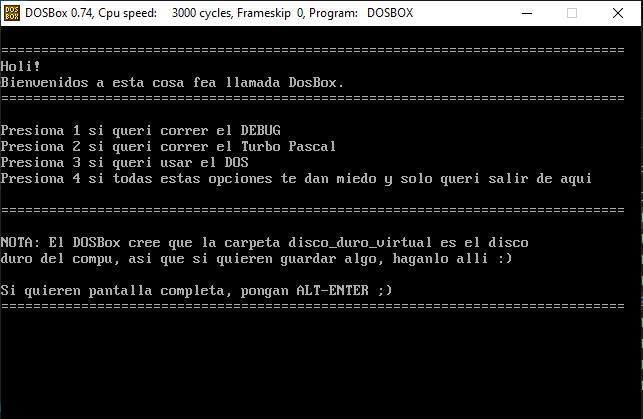
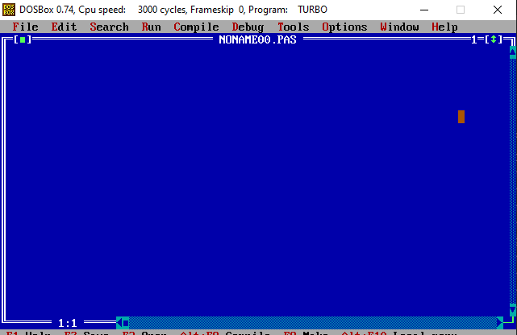
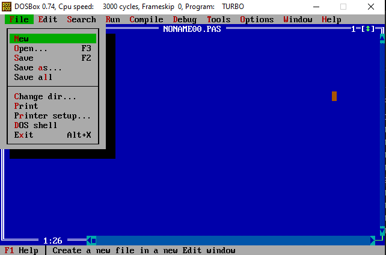
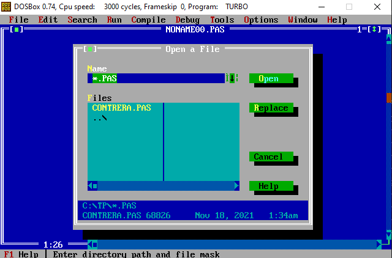
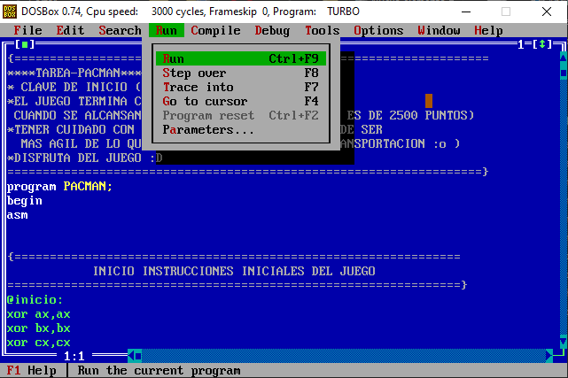
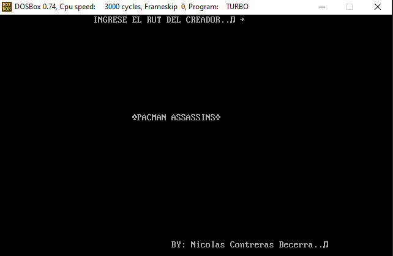
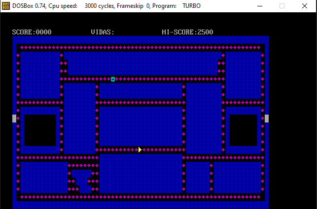

# Assembler-pacman

Juego programado en Assembler usando el IDE Turbo Pascal

# Manual de ejecución

El juego solo puede ser ejecutados desde el sistema operativo Windows.
Para ejecutar el juego se deben seguir los siguientes pasos:

## Paso 1

Se debe abrir DOSBox, ejecutando el archivo .bat llamado "Iniciar DOSBox.bat"

## Paso 2

Al abrir DOSBox no mostrar un menú como el que se muestra en la siguiente imagen.

En esta ventana se debe presionar 2 el cual ejecutará Turbo Pascal y abrirá la siguiente ventana.

## Paso 3

Para abrir el archivo que posee el código se debe presionar en "File" y luego en "Open".

Ahora se debe seleccionar el código CONTRERAS.PAS y luego presionar en "Open"

Una vez abierto el código se debe presionar en "Run" y seleccionar la opción "Run", esto abrirá el juego.

## Paso 4

Una vez abierto el juego pedirá ingresar el RUT, para esto se debe ingresar 000.

Ingresado el juego se podra jugar de esta versíon de pacman

